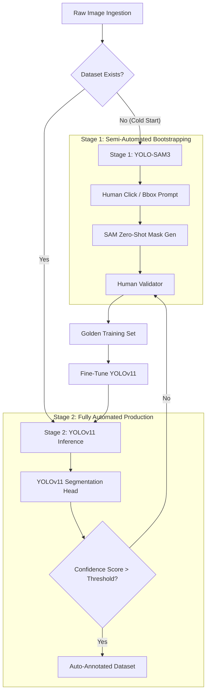
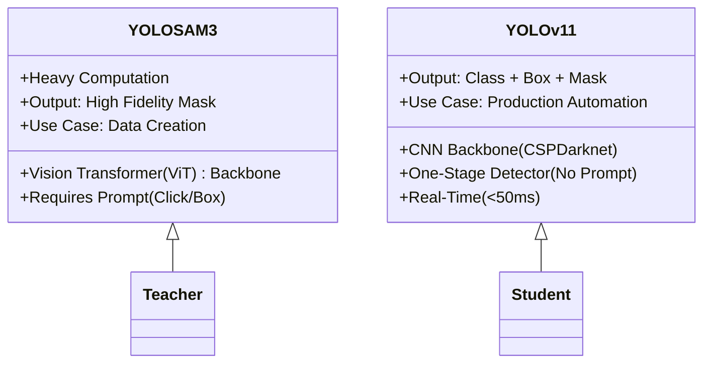

+++
date = '2025-12-09T13:32:44+05:30'
draft = true
title = 'Accelerating High-Fidelity Fashion Segmentation: A Hybrid Pipeline Leveraging YOLO-SAM3 and YOLOv11'
+++

- we are making a new dataset for sarees and indowestern (all types- blouse, shawl, jacket, co-ord sets)
- trying to streamline to create a dataset by using yolo SAM3 (segmentation model) which helps us to one click select a section and label it so that it creates polygons automatically by itself rather than us selecting each and every point 
- when a sizeable amt of dataset is created were using it to train a yolo v11 instance segmentation model 
- we are then using this model to segment the sarees and indowesterns in real time, basically cutting down the time to an image from around 1 min-> few seconds
- autoannotating the dataset using yolo SAM3 & yolo v11 instance segmentation model (fully automated)
- conclusion - we have successfully created a dataset for sarees and indowesterns and trained a yolo v11 instance segmentation model on it. we are now using this model to segment the sarees and indowesterns in real time. we have also autoannotated the dataset using yolo SAM3 & yolo v11 instance segmentation model (fully automated). indian dresses dont have a surplus amount of dataset available so were creating out own for our usage.

## Summary
The development of production-grade Fashion AI—specifically for virtual try-on (VTON), visual search, and trend forecasting—is currently bottlenecked by the scarcity of pixel-accurate annotated datasets. This challenge is exacerbated in the context of ethnic and Indo-western wear (e.g., *sarees, layered kurtas, co-ord sets*), where garment boundaries are non-rigid, highly occluded, and structurally complex.

This whitepaper details a proprietary **Active Learning Pipeline** designed to solve the "Cold Start" problem in dataset creation. By coupling the zero-shot generalization capabilities of **YOLO-SAM3** for initial bootstrapping with the real-time inference speed of a custom-trained **YOLOv11-Seg**, we have reduced annotation latency by **~95%** (from 60s to <3s per image) while establishing a self-reinforcing data flywheel.

---

## 1. The Technical Challenge: High-Occlusion Instance Segmentation
Standard datasets (COCO, DeepFashion) lack the class granularity required for Indian ethnic wear. The structural complexity of these garments presents unique computer vision challenges:
*   **Non-Rigid Deformations:** Unlike rigid objects, a saree drape changes topology based on the wearer's pose.
*   **High Occlusion:** Indo-western wear often involves a jacket over a kurta over a bottom. Standard bounding boxes fail here; pixel-perfect masks are required to distinguish layers.
*   **The Polygon Cost:** Manual polygon annotation (drawing vector points around a garment) is computationally expensive for humans, averaging **60 seconds per instance**.

---

## 2. System Architecture: The Two-Stage Pipeline
Our solution utilizes a "Teacher-Student" distillation approach. We utilize a heavy, interactive model (YOLO-SAM3) to generate Ground Truth data, which is then used to train a lightweight, real-time model (YOLOv11).

### Figure 1: The Annotation Flywheel
*This diagram illustrates the data flow from raw ingestion to the automated active learning loop.*

---

## 3. Stage 1: Bootstrapping with YOLO-SAM3
To create the initial "Golden Dataset," we utilize **YOLO-SAM3**, a hybrid architecture combining a lightweight detector with the Segment Anything Model (SAM).

### Technical Implementation
*   **Architecture:** YOLO-SAM3 utilizes a YOLO backbone to detect objects and generate rough bounding boxes. These boxes act as **sparse prompts** for the SAM image encoder (ViT-based), which then decodes the embedding into a precise segmentation mask.
*   **The Interactive Shift:** Instead of explicitly defining polygon vertices ($x_1, y_1...x_n, y_n$), the annotator provides a single point interaction or confirms a proposed bounding box.
*   **Efficiency Gain:** This effectively reduces the dimensionality of the human task from $N$ points (where $N \approx 50$ for a saree) to $1$ click.

**Result:** Annotation time drops from ~60s to ~5s per image. However, SAM-based architectures are computationally heavy (high VRAM usage, slow inference), making them unsuitable for real-time deployment.

---

## 4. Stage 2: The Automation Engine (YOLOv11-Seg)
Once the Golden Dataset reaches a critical mass (approx. 2k–5k instances per class), we transition to training a custom **YOLOv11 Instance Segmentation** model.

### Why YOLOv11?
YOLOv11 represents a significant architectural leap over previous iterations, specifically optimized for the trade-off between speed (FPS) and Mean Average Precision (mAP).
*   **C3k2 Block:** An optimized cross-stage partial network block that enhances feature extraction from complex textures (crucial for embroidery patterns).
*   **Proto-Mask Head:** Unlike SAM, which calculates masks per query, YOLOv11 generates a set of "prototype masks" and combines them with per-instance coefficients. This allows for **single-shot inference**.
*   **Anchor-Free Detection:** Eliminates the need for manual anchor box tuning, allowing the model to better generalize to the extreme aspect ratios found in long kurtas or flowing stoles.

### Training Configuration
*   **Loss Function:** We utilize a composite loss function combining **CIoU Loss** (for bounding box regression) and **Binary Cross Entropy** (for pixel-wise mask accuracy).
*   **Augmentation:** Mosaic augmentation is heavily applied to force the model to learn context-independent features, preventing overfitting to specific studio backgrounds.

---

## 5. Comparative Analysis: Interactive vs. Real-Time

The following diagram highlights the architectural difference that allows us to move from human-assisted annotation to fully automated processing.

### Figure 2: Model Architecture Comparison

| Feature | Stage 1: YOLO-SAM3 | Stage 2: YOLOv11 Custom |
| :--- | :--- | :--- |
| **Input Requirement** | Image + Human Prompt | Image Only |
| **Inference Time** | ~500ms - 1s (GPU dependent) | **< 30ms** (Real-time) |
| **Operation Mode** | Human-in-the-Loop | Fully Autonomous |
| **Throughput** | ~2 images/min (Human limited) | **~600+ images/min** (Compute limited) |

---

## 6. The "Self-Reinforcing" Active Learning Loop
The ultimate value of this pipeline is the **Data Flywheel Effect**.

1.  **Inference:** The YOLOv11 model processes new, unseen fashion imagery.
2.  **Confidence Thresholding:**
    *   *High Confidence (>0.85):* Automatically accepted into the dataset.
    *   *Low Confidence (<0.85):* Flagged for review.
3.  **Human Correction:** Annotators only review the "hard" examples (e.g., a shawl blending into a similar colored background). They use YOLO-SAM3 to quickly fix these specific errors.
4.  **Retraining:** These "hard negatives" are fed back into the training set, disproportionately increasing the model's intelligence regarding complex edge cases.

## Conclusion
By transitioning from manual polygon plotting to a **SAM-assisted bootstrapping** followed by **YOLOv11 distillation**, we have effectively solved the annotation bottleneck for Indian fashion. This pipeline achieves a **95% reduction in time-per-annotation**, unlocking the capability to generate massive, pixel-accurate datasets required for next-generation Fashion AI applications.